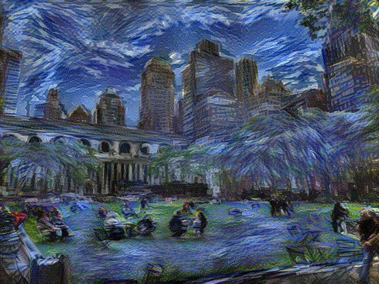

# Style-Transfer-Algorithm implemented in TensorFlow

This is a TensorFlow implementation of [*A Neural Algorithm of Artistic Style*](https://arxiv.org/pdf/1508.06576v2.pdf) using [total variation denoising](http://eeweb.poly.edu/iselesni/lecture_notes/TVDmm/TVDmm.pdf) as a regularizer. We used a pretrained [VGG network](https://arxiv.org/pdf/1409.1556.pdf), which is provided [here](https://github.com/machrisaa/tensorflow-vgg) by [machrisaa](https://github.com/machrisaa) on GitHub. The VGG implementation was customized to accomodate our requirements and is of the 19-layer variety.

Using this implementation, we were able to emulate and achieve the same stylistic results as those in the original paper.

The purpose of this repository is to port the joint [texture-synthesizing](https://arxiv.org/pdf/1505.07376v3.pdf) and [representation-inverting](https://arxiv.org/pdf/1412.0035v1.pdf) stylistic-transfer algorithm to TensorFlow.

## Results

#### Input


<table style="width:100%">
  <tr>
    <th>Style</th> 
    <th>Result</th>
  </tr>
  <tr>
    <td></td>
    <td></td> 
  </tr>
  <tr>
    <td></td>
    <td></td> 
  </tr>
  <tr>
    <td></td>
    <td></td> 
  </tr>
</table>

## Prerequisites

* [Python 3.5](https://www.python.org/downloads/release/python-350/)
* [TensorFlow](https://www.tensorflow.org/) (>= r0.12)
* [SciPy](https://www.scipy.org/)
* [NumPy](http://www.numpy.org/)

## Usage

To stylize an image, run:

```sh
python style_transfer.py --input path/to/input/image --style path/to/style/image --output path/to/output/image
```

The default paths for input, style, and output are "photo.jpg", "art.jpg", and "./" respectively.The first two files are supplied in this repository.

## Files

* [style_transfer.py](style_transfer.py)

    The main script where all the magic happens. 

* [custom_vgg19.py](custom_vgg19.py)
    
    A modified implementation of the VGG 19 network. This particular customization changes the default pooling of max pooling to average pooling, which allows more effective gradient flow.

* [vgg19.npy](https://mega.nz/#!xZ8glS6J!MAnE91ND_WyfZ_8mvkuSa2YcA7q-1ehfSm-Q1fxOvvs)

    The weights used by the VGG network. This file is not in this repository due to its size. You must download it and place in the working directory. The program will complain and ask for you to download it with a supplied link if it does not find it.
    
* [utils.py](utils.py)

    Auxiliary routines for parsing images into numpy arrays used in the implementation.